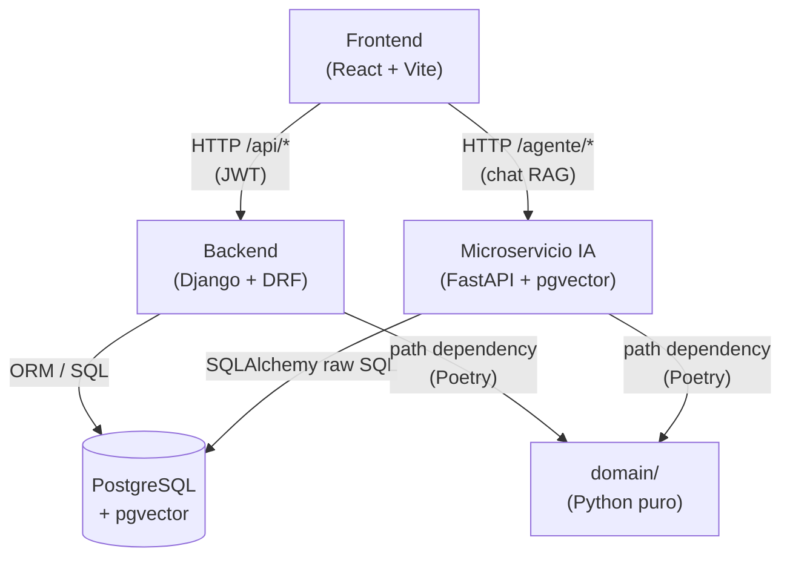

# LiteThinking — Prueba Técnica 2026

Aplicación full-stack que gestiona el catálogo de **empresas** y sus **productos**, con autenticación JWT, auditoría hash-chain, exportación PDF/email, y un agente IA conversacional basado en RAG.

Construida sobre Arquitectura Limpia: el paquete `domain/` concentra toda la lógica de negocio sin depender de ningún framework; `backend/` orquesta la aplicación con Django; `microservices/ai-agent/` es un servicio FastAPI independiente; y `frontend/` presenta la interfaz React.

---

## Arquitectura general



> Tanto `backend/` como `microservices/ai-agent/` comparten la **misma base de datos PostgreSQL**. `domain/` no tiene dependencias de framework; se instala como paquete local desde cada capa.

---

## Stack tecnológico

| Componente | Tecnologías |
|---|---|
| **domain/** | Python 3.11+, dataclasses, pytest |
| **backend/** | Python 3.11+, Django 4.2, Django REST Framework 3.14, SimpleJWT, django-environ, django-cors-headers, psycopg2, reportlab |
| **microservices/ai-agent/** | Python 3.11+, FastAPI, SQLAlchemy 2, pgvector, LangChain, OpenAI (gpt-4o-mini + text-embedding-3-small), cachetools, pytest |
| **frontend/** | Node 18+, React 18, TypeScript, Vite 5, Tailwind CSS, Zustand, Recharts, Axios |
| **Infraestructura** | PostgreSQL 15+, extensión pgvector |

---

## Requisitos previos

| Herramienta | Versión mínima | Notas |
|---|---|---|
| Python | 3.11 | Probado en 3.14 |
| Node.js | 18 LTS | |
| PostgreSQL | 15 | Con extensión `pgvector` |
| Poetry | 1.7+ | Para `domain/`, `backend/` y `microservices/ai-agent/` |
| pgvector | 0.7+ | `CREATE EXTENSION vector;` en la BD |

---

## Instalación y ejecución paso a paso

### 0. Base de datos

```sql
-- Conectado como superusuario (ej. psql -U postgres)
CREATE DATABASE litethinking;
\c litethinking
CREATE EXTENSION IF NOT EXISTS vector;
```

### 1. Capa de dominio (`domain/`)

```bash
cd domain
poetry install
# Verificar:
poetry run pytest
```

### 2. Backend Django (`backend/`)

```bash
cd backend

# Instalar dependencias (incluye domain/ como path dep)
poetry install

# Configurar entorno
copy .env.example .env          # Windows
# cp .env.example .env          # macOS/Linux
# Editar .env: completar SECRET_KEY, DATABASE_URL, EMAIL_* según necesidad

# Aplicar migraciones
poetry run python manage.py migrate

# Crear el primer usuario Administrador
poetry run python manage.py crear_admin --email admin@empresa.com --password "Admin123!"

# Cargar datos iniciales de tasas de cambio (opcional)
poetry run python manage.py shell -c "
from apps.productos.models import TasaCambioModel
TasaCambioModel.objects.get_or_create(moneda_origen='USD', moneda_destino='COP', defaults={'tasa': 4100})
TasaCambioModel.objects.get_or_create(moneda_origen='EUR', moneda_destino='COP', defaults={'tasa': 4500})
TasaCambioModel.objects.get_or_create(moneda_origen='USD', moneda_destino='EUR', defaults={'tasa': 0.92})
"

# Iniciar servidor (puerto 8000)
poetry run python manage.py runserver
```

> **Nota:** `DATABASE_URL` es opcional. Si no se define, Django usa SQLite automáticamente (útil para desarrollo sin PostgreSQL). Para el agente IA se requiere PostgreSQL.

### 3. Microservicio IA (`microservices/ai-agent/`)

```bash
cd microservices/ai-agent

# Instalar dependencias
poetry install

# Configurar entorno
copy .env.example .env          # Windows
# cp .env.example .env          # macOS/Linux
# Editar .env: pegar OPENAI_API_KEY (obligatorio para que el chat funcione)

# Iniciar servidor (puerto 8001)
poetry run uvicorn main:app --host 0.0.0.0 --port 8001 --reload
```

Después de crear productos desde el frontend, vectorizar el catálogo:

```bash
# Con el servidor ya corriendo:
curl -X POST http://localhost:8001/agente/reindexar
# O desde el script:
poetry run python scripts/vectorizar_productos.py
```

### 4. Frontend React (`frontend/`)

```bash
cd frontend
npm install

# Copiar variables de entorno (opcional en desarrollo — hay fallbacks hardcodeados)
copy .env.example .env

# Iniciar en modo desarrollo (puerto 3000)
npm run dev
```

La aplicación queda disponible en **http://localhost:3000**.

---

## Usuarios y roles

| Acción | Cómo |
|---|---|
| Crear Administrador | `python manage.py crear_admin --email X --password Y` |
| Crear usuario Externo | Registro desde la UI en `/registro` |
| Permisos Administrador | CRUD completo + acceso al Dashboard |
| Permisos Externo | Solo lectura + chat con agente IA |

---

## Correr los tests

```bash
# domain/
cd domain && poetry run pytest

# backend/ (todos)
cd backend && poetry run pytest -q

# backend/ (solo empresas)
cd backend && poetry run pytest apps/empresas/ -q

# microservicio IA
cd microservices/ai-agent && poetry run pytest tests/ -v
```

---

## Estructura de carpetas

```
litethinking/
├── domain/                  # Paquete Python independiente — entidades y reglas de negocio
│   ├── domain/entities/     # Empresa, Producto, Precio, BloqueAuditoria
│   └── tests/
├── backend/                 # Django: capa de aplicación + infraestructura
│   ├── apps/
│   │   ├── authentication/  # JWT, registro, roles
│   │   ├── empresas/        # CRUD empresas, PDF, email
│   │   ├── productos/       # CRUD productos, tasas de cambio, auto-vectorización
│   │   ├── auditoria/       # Log hash-chain inmutable
│   │   └── dashboard/       # Métricas agregadas (solo Administrador)
│   └── config/              # Settings, URLs, WSGI
├── microservices/
│   └── ai-agent/            # FastAPI: RAG con pgvector, cache TTL, embeddings OpenAI
│       ├── routers/         # Endpoints /agente/consulta, /agente/reindexar
│       └── services/        # rag.py, embeddings.py, cache.py
├── frontend/                # React + Atomic Design
│   └── src/
│       ├── components/
│       │   ├── atoms/       # Button, Input, Label, Badge
│       │   ├── molecules/   # FormField, Card
│       │   └── organisms/   # NavbarTabs, MosaicoEmpresas, ChatWidget
│       ├── pages/           # EmpresasPage, ProductosPage, DashboardPage, ...
│       ├── store/           # Zustand (auth)
│       └── types/           # Interfaces TypeScript
└── docs/                    # Decisiones de arquitectura, diagramas, guías
```

---

## Documentación técnica

| Documento | Contenido |
|---|---|
| [docs/arquitectura.md](docs/arquitectura.md) | Arquitectura Limpia, capas, dependencias |
| [docs/decisiones-tecnicas.md](docs/decisiones-tecnicas.md) | Justificación de cada decisión de diseño |
| [docs/funcionalidad-ia.md](docs/funcionalidad-ia.md) | Flujo RAG, modelos, cache |
| [docs/despliegue.md](docs/despliegue.md) | Variables de entorno, checklist de deploy |
